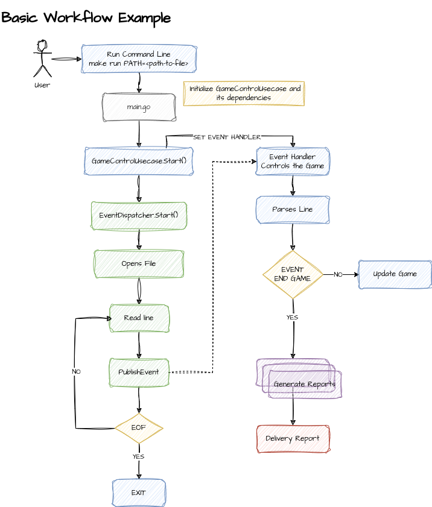

# My First Go Project

My first Go project: parsing Quake 3 log files to generate reports.

## Usage

To run the project:

```bash
make run  # Use default file
make run PATH=<path_to_your_file.log>
```

## Running the Tests

To run the tests, execute the following command:

```bash
make test
```

## Basic workflow example

